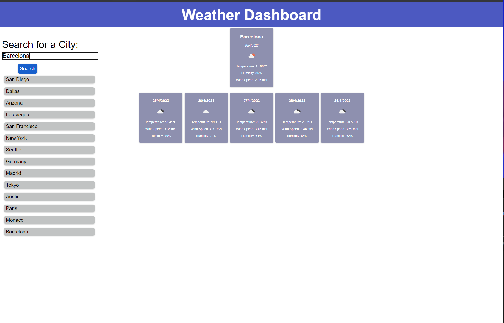

# Weather Dashboard

Weather Dashboard is a web application that allows travelers to check the current weather and 5-day forecast for any city. This application is built using HTML, CSS, and JavaScript, and it fetches data from the OpenWeatherMap API.

## Features

- Search for a city to view its weather information
- Displays current weather conditions including city name, date, weather icon, temperature, humidity, and wind speed
- Presents a 5-day forecast with date, weather icon, temperature, wind speed, and humidity
- Saves search history and allows users to click on a previously searched city to view its weather again

## APIs Used

- [OpenWeatherMap 5 Day Weather Forecast API](https://openweathermap.org/forecast5) for retrieving weather data
- [OpenWeatherMap Current Weather Data API](https://openweathermap.org/current) for retrieving geographical coordinates given a city name

## Getting Started

1. Clone this repository or download the ZIP file
2. Open the `index.html` file in your browser
3. Start searching for cities to view their weather information

## Usage

1. Type a city name into the search input and press enter or click the search button
2. The current weather and 5-day forecast for the city will be displayed on the screen
3. Your search history will be saved below the search input
4. Click on a previously searched city in the search history to view its weather information again

## License

This project is licensed under the MIT License.
